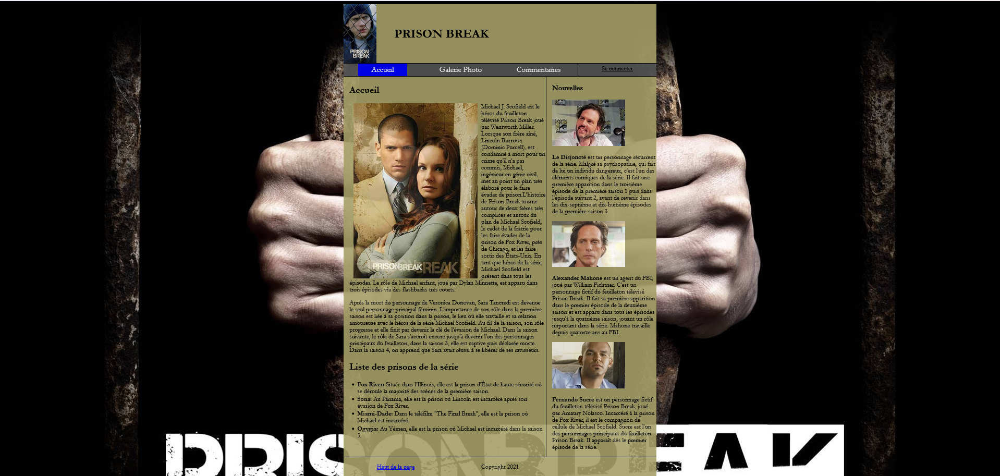
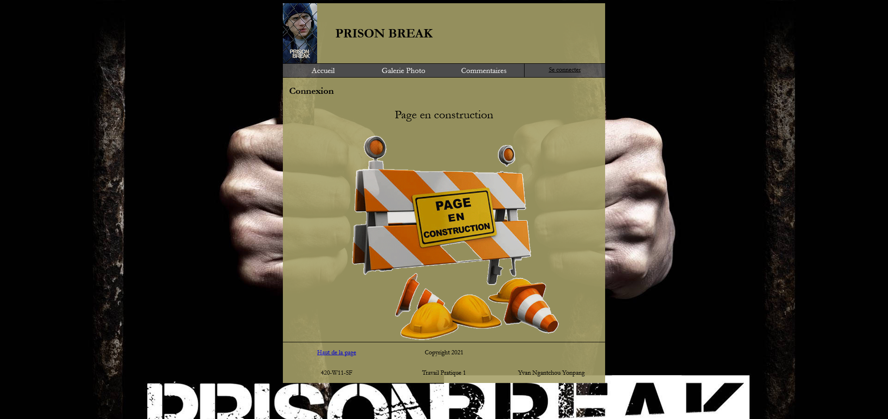
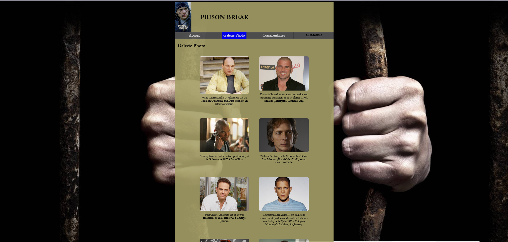
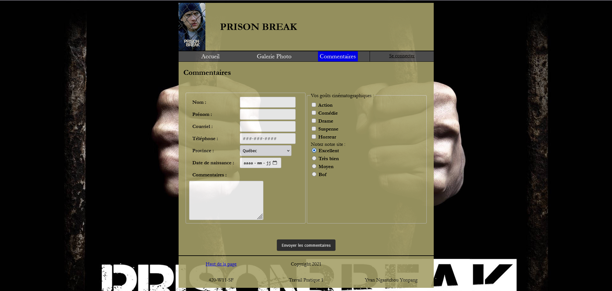

# 🔐 Prison Break — Travail Pratique

Site web consacré à la série télévisée **Prison Break**, réalisé dans le cadre d'un travail pratique en développement web.

Le projet présente différentes pages permettant de découvrir l'univers de la série, ses personnages et plusieurs informations à travers une interface web créée en HTML et CSS.

## 📋 Présentation

Ce projet consiste à créer un site web thématique autour de la série **Prison Break**.

Le site propose plusieurs sections accessibles à partir d'une barre de navigation :

* une page d'accueil présentant la série;
* une galerie de photos des personnages;
* un formulaire permettant de laisser des commentaires;
* une page de connexion actuellement en construction.

## ✨ Fonctionnalités

* 🏠 **Page d'accueil**

  * Présentation de la série Prison Break
  * Présentation de plusieurs personnages
  * Informations sur les différentes prisons de la série
  * Section consacrée aux nouvelles

* 🖼️ **Galerie photo**

  * Présentation de plusieurs personnages de la série
  * Images accompagnées d'informations descriptives

* 💬 **Commentaires**

  * Formulaire de commentaires
  * Champs nom et prénom
  * Adresse courriel
  * Numéro de téléphone
  * Province
  * Date de naissance
  * Zone de commentaire
  * Sélection des goûts cinématographiques
  * Évaluation du site

* 🔐 **Connexion**

  * Page de connexion prévue dans la navigation
  * Page actuellement en construction

## 🛠️ Technologies utilisées

* HTML5
* CSS3

## 📁 Structure du projet

```text
TP1-Yvan-Ngantchou-Yonpang/
│
├── index.html
├── commentaires.html
├── connexion.html
├── galerie-images.html
│
├── css/
│   └── styles.css
│
├── img/
│   └── Images du projet
│
├── screenshots/
│   ├── accueil.png
│   ├── connexion.png
│   ├── galerie.png
│   └── commentaires.png
│
└── README.md
```

## 📸 Aperçu du projet

### 🏠 Page d'accueil



### 🔐 Page de connexion



### 🖼️ Galerie photo



### 💬 Page de commentaires



## 🚀 Utilisation

Aucune installation particulière n'est nécessaire.

Pour consulter le projet :

1. Télécharger ou cloner le dépôt.
2. Ouvrir le fichier `index.html`.
3. Naviguer entre les différentes pages à l'aide du menu.

Le projet peut également être ouvert directement dans un navigateur à partir de Visual Studio Code.

## 🎯 Objectifs du projet

Ce travail permet de mettre en pratique :

* la création de pages web en HTML5;
* l'utilisation de CSS pour la mise en forme;
* la création d'une navigation entre plusieurs pages;
* la création de formulaires HTML;
* l'utilisation de champs de saisie;
* l'utilisation de cases à cocher et de boutons radio;
* l'organisation des ressources d'un projet web;
* l'intégration d'images dans une page web;
* la création d'une galerie photo.

## 👨‍💻 Auteur

**Yvan Ngantchou Yonpang**

Projet réalisé dans le cadre de la formation en développement d'applications sécuritaires.

